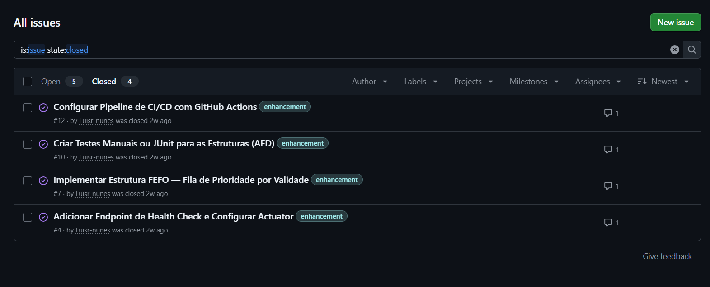
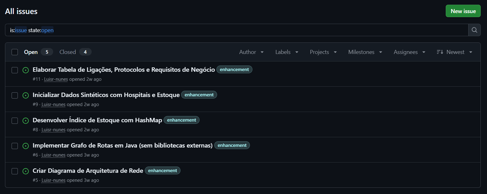

<h1 align="center">Rota Vital</h1>

<p align="center">
  <b>Gestão e distribuição de hemocomponentes na rede de sangue</b>
</p>

<p align="center">
  
  
  
  
  
</p>

<p align="center">
  <a href="#sobre-o-projeto">Sobre</a> •
  <a href="#problema">Problema</a> •
  <a href="#solução">Solução</a> •
  <a href="#tecnologias-utilizadas">Tecnologias</a> •
  <a href="#como-rodar-o-projeto">Como Rodar</a> •
  <a href="#entregas">Entregas</a> •
  <a href="#equipe">Equipe</a>
</p>

---

## Sobre o Projeto

O **Rota Vital** é o Projeto Integrador do 3º semestre do curso de **Análise e Desenvolvimento de Sistemas** da **CESAR School (2026.2)**. Trata-se de uma aplicação web em **Java/Spring Boot** que apoia a rede de sangue na **gestão e distribuição de hemocomponentes**.

O sistema é inspirado no fluxo da **Hemorrede/SUS** (centros de coleta e doação → hemocentro de processamento e controle → estoque → hospitais) e utiliza exclusivamente **dados sintéticos**.

### Disciplinas envolvidas

| Disciplina | Contribuição no Projeto |
|---|---|
| **Programação Orientada a Objetos (POO)** | Núcleo da aplicação web em Java/Spring Boot |
| **Algoritmos e Estruturas de Dados (AED)** | Roteirização (Dijkstra), compatibilidade ABO/Rh, FEFO |
| **Estatística e Probabilidade (EST)** | Indicadores, painéis e análise probabilística |
| **Infraestrutura de Software (SO)** | CI/CD, deploy em nuvem, concorrência (threads) |
| **Infraestrutura de Comunicação (RSD)** | Arquitetura de rede, telemetria, monitoramento |
| **Projeto 3** | Gestão de processo, integração e apresentação final |

---

## Problema

A rede de sangue precisa garantir o **componente certo** (compatível e dentro da validade), **no lugar certo**, **no tempo certo** e **na temperatura certa**. Falhas nesse processo geram:

- Desabastecimento de hemocomponentes
- Descarte por vencimento de validade
- Risco direto ao paciente

**Falta uma plataforma que integre estoque, compatibilidade, roteirização e monitoramento da cadeia fria.**

---

## Solução

O **Rota Vital** é uma aplicação web que:

- **Gerencia o estoque** de hemocomponentes por tipo e componente sanguíneo
- **Recebe requisições** dos hospitais
- **Aloca bolsas compatíveis** (ABO/Rh) priorizando a validade (**FEFO** — *First Expired, First Out*)
- **Calcula rotas de distribuição** respeitando a cadeia fria e as janelas de tempo (Dijkstra)
- **Monitora temperatura e rede** em painéis de indicadores

---

## Tecnologias Utilizadas

| Tecnologia | Uso |
|---|---|
| **Java** | Linguagem principal |
| **Spring Boot** | Framework web (Controllers, Services, Repositories) |
| **HTML / CSS** | Interface web (Thymeleaf ou API REST + Frontend) |
| **Banco de Dados** | Persistência de dados (a definir pela equipe) |
| [**Jira**](https://csprj-adsr-3p-e5.atlassian.net/browse/PI2) | Gestão e controle de atividades do projeto — [quadro do projeto](https://csprj-adsr-3p-e5.atlassian.net/browse/PI2) |
| **GitHub** | Versionamento de código e Issue/Bug Tracker |
| **Figma** | Prototipação Lo-Fi |
| **YouTube** | Screencasts das entregas |

> **Observação:** O uso de Lombok ou qualquer outro mecanismo de geração de código boilerplate **NÃO é permitido**.

---

## Como Rodar o Projeto

### Pré-requisitos
- **Java 17+** (JDK 17 ou superior)
- **Maven 3.8+** (ou através de extensão na sua IDE — VS Code, IntelliJ IDEA ou Eclipse)
- **Git**

### Passo a Passo de Execução

1. **Clone o repositório:**
   ```bash
   git clone https://github.com/Luisr-nunes/projeto_Rota_Vital.git
   ```

2. **Acesse o diretório do backend:**
   ```bash
   cd projeto_Rota_Vital/rotavital
   ```

3. **Execute a aplicação:**
   * **Via Maven:**
     ```bash
     mvn spring-boot:run
     ```
   * **Ou gerando o pacote JAR e executando:**
     ```bash
     mvn clean package -DskipTests
     java -jar target/hemorede-0.0.1-SNAPSHOT.jar
     ```

### Acessos e Endpoints Principais
* **Aplicação / Base API:** `http://localhost:8080`
* **Painel Web de Indicadores:** `http://localhost:8080/indicadores.html`
* **Health Check (Spring Boot Actuator):** `http://localhost:8080/actuator/health`
* **Console H2 (Banco em Memória):** `http://localhost:8080/h2-console`
  * **JDBC URL:** `jdbc:h2:mem:hemorede`
  * **Usuário:** `sa`
  * **Senha:** *(vazia)*

---

## Entregas

### Entrega 01

**Data de entrega:** 31/08/2026

#### Artefatos

- [✅] **Histórias de Usuário** — Mínimo de 7 histórias bem definidas (formato BDD, arquivo `.md` no GitHub)
  - [Link para as Histórias](doc/historias_de_usuario.md)
- [✅] **Protótipo Lo-Fi (Figma)** — Mínimo de 5 histórias prototipadas
  - [Link para o Figma](https://www.figma.com/site/snA4pKexELM7gW9JGih8iu/rota-vital-lofi?t=bL7QBDZxJXV2m1Pe-6)
- [✅] **Screencast do Protótipo** — Vídeo no YouTube explicando o protótipo Figma (com áudio ou legenda)
  - [Assistir no YouTube](https://www.youtube.com/watch?v=-Tl4rPthJ5Q) <!-- inserir link do YouTube -->

---

### Entrega 02

**Data de entrega:** 21/09/2026

#### Histórias Implementadas

```
┌─────────────────────────────────────────────────────────────────────────────┐
│ 📌 POST-IT 1 — HU04: Alocar bolsas compatíveis por FEFO                     │
├─────────────────────────────────────────────────────────────────────────────┤
│ 👤 COMO: Profissional do hemocentro                                         │
│ 🎯 QUERO: Alocar bolsas de sangue compatíveis a uma requisição hospitalar,  │
│           priorizando estritamente as de validade mais próxima              │
│ 💡 PARA QUE: Seja possível atender aos hospitais com segurança e reduzir o  │
│              descarte de hemocomponentes por vencimento                     │
├─────────────────────────────────────────────────────────────────────────────┤
│ 📋 CRITÉRIOS DE ACEITE & REGRAS DE NEGÓCIO:                                 │
│  • Apenas bolsas compatíveis (matriz ABO/Rh) e dentro da validade são       │
│    alocadas.                                                                │
│  • Ordenação FEFO (First Expired, First Out) via Min-Heap (FilaFEFO).       │
│  • A bolsa alocada passa para o status RESERVADA.                           │
│  • Caso o estoque não supra a quantidade total solicitada, a transação      │
│    é revertida (rollback) e a requisição permanece com status PENDENTE.     │
│ 💻 Módulos: RequisicaoController, RequisicaoService, AlocacaoService,        │
│             FilaFEFO, IndiceEstoque, BolsaRepository.                       │
└─────────────────────────────────────────────────────────────────────────────┘
```

```
┌─────────────────────────────────────────────────────────────────────────────┐
│ 📌 POST-IT 2 — HU05: Planejar rota de entrega de menor custo                │
├─────────────────────────────────────────────────────────────────────────────┤
│ 👤 COMO: Operador de logística da Hemorrede                                 │
│ 🎯 QUERO: Calcular a rota de menor custo (tempo/distância) do Hemocentro    │
│           até o hospital solicitante                                        │
│ 💡 PARA QUE: A entrega de hemocomponentes seja rápida, eficiente e          │
│              respeite a cadeia de temperatura de transporte                 │
├─────────────────────────────────────────────────────────────────────────────┤
│ 📋 CRITÉRIOS DE ACEITE & REGRAS DE NEGÓCIO:                                 │
│  • Roteirização parte obrigatoriamente do Hemocentro (N0) para o hospital.  │
│  • Menor caminho computado pelo algoritmo de Dijkstra manual sobre a        │
│    malha viária sintética de 6 nós (N0 a N5).                               │
│  • Retorno com nós visitados, distância total (km) e tempo estimado (min).  │
│  • Se o hospital não possuir nó alcançável no grafo, retorna HTTP 422       │
│    (RotaIndisponivelException).                                             │
│ 💻 Módulos: RotaController (POST /api/rotas/calcular), RoteirizacaoService,  │
│             GrafoRotas, DadosSinteticos.                                    │
└─────────────────────────────────────────────────────────────────────────────┘
```

#### Artefatos

- [x] Ao menos **2 histórias implementadas** (Spring Boot rodando com **HU04** e **HU05**)
- [x] **Ambiente de versionamento atuante** (commits frequentes de código semanais na branch principal `main`)
- [x] **Issue/Bug Tracker atualizado (GitHub Issues)**
  - *Histórico de Issues Fechadas:*
    
    

  - *Issues Abertas / Backlog das Sprints:*
    
    

- [ ] **Screencast do sistema** — Vídeo no YouTube demonstrando as histórias implementadas (com áudio ou legenda)
  - [Assistir no YouTube](#) <!-- Inserir link do YouTube após a gravação -->
- [ ] **Screencast do código** — Vídeo no YouTube explicando o código Spring Boot (com áudio ou legenda)
  - [Assistir no YouTube](#) <!-- Inserir link do YouTube após a gravação -->

---

### Entrega 03

**Data de entrega:** 19/10/2026

#### Histórias Implementadas

> *Adicionar aqui a descrição (formato POST-IT) das histórias implementadas nesta entrega.*

#### Artefatos

- [ ] Mais **2 histórias implementadas**
- [ ] Commits frequentes (mínimo semanais)
- [ ] Issue/Bug Tracker atualizado
  - *Print do Bug Tracker:* <!-- inserir screenshot -->
- [ ] **Screencast do sistema** — Novas histórias implementadas (com áudio ou legenda)
  - [Assistir no YouTube](#) <!-- inserir link -->
- [ ] **Screencast do código** — Explicação do código das novas histórias (com áudio ou legenda)
  - [Assistir no YouTube](#) <!-- inserir link -->

---

### Entrega 04

**Data de entrega:** 09/11/2026

#### Histórias Implementadas

> *Adicionar aqui a descrição (formato POST-IT) das histórias implementadas nesta entrega.*

#### Artefatos

- [ ] Implementação das **histórias restantes** (mínimo de 2)
- [ ] Commits frequentes (mínimo semanais)
- [ ] Issue/Bug Tracker atualizado
  - *Print do Bug Tracker:* <!-- inserir screenshot -->
- [ ] **Screencast do sistema** — Ênfase nas novas histórias (com áudio ou legenda)
  - [Assistir no YouTube](#) <!-- inserir link -->
- [ ] **Screencast do código** — Explicação do código das histórias implementadas (com áudio ou legenda)
  - [Assistir no YouTube](#) <!-- inserir link -->

---

### Apresentação Final

**Data:** 09/11 a 13/11/2026 (dia da aula)

Resumo de até **8 minutos** abordando:

| Tópico | Descrição |
|---|---|
| **O Problema** | O que o produto busca resolver |
| **A Solução** | Características, público-alvo, histórias implementadas, diferencial |
| **Fluxo de Trabalho** | Planejamento, requisitos, desenvolvimento, gerência de configuração, testes |
| **Ferramentas** | Ferramentas utilizadas (incluindo links) |
| **Lições Aprendidas** | O que aprendemos com o processo |
| **Demonstração** | Demonstração rápida do produto funcionando |

> **Todos os membros do grupo devem estar presentes na apresentação.**

---

## Equipe

| Função | Matrícula | Responsável | E-mail |
|---|---|---|---|
| Tech Lead | 2025200261 | Lucas Henrique Gomes Medeiros | lhgm@cesar.school |
| Gerente de Projetos | 2025200183 | Luis Felipe Farias Nunes | lffn@cesar.school |
| Desenvolvedor Backend | 2025200142 | João Pedro Cavalcanti Souza | jpcs2@cesar.school |
| Desenvolvedor Backend | 2025200197 | Luis Lucena Wanderley G. | llwg@cesar.school |
| Desenvolvedor Backend | 2025200043 | Matheus Rodrigues Larré | mrl2@cesar.school |
| Engenheira de Dados | 2025200311 | Micaella Maria Barbosa Cabral | mmbc2@cesar.school |
| Desenvolvedor Frontend | 2025200139 | Mariana Xavier Bezerra | mxb@cesar.school |

---

## Histórico de Membros

| Nome | E-mail | Data de Entrada | Data de Saída | Observação |
|---|---|---|---|---|
| — | — | — | — | *Nenhuma alteração até o momento.* |

---

## Referências

- [A crash course on writing a better README](https://hackernoon.com/a-crash-course-on-writing-a-better-readme-d796d1f6b352)
- [Make a README](https://www.makeareadme.com/)
- [Hall of Fame — Sourcerer](https://github.com/sourcerer-io/hall-of-fame)

---

<p align="center">
  <b>CESAR School — ADS 2026.2 — 3º Semestre</b><br/>
  Projeto Integrador — Rota Vital
</p>

