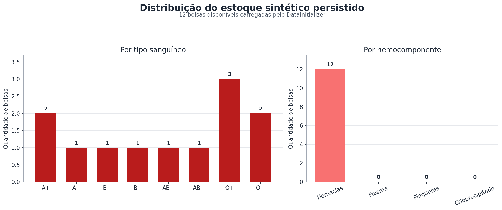
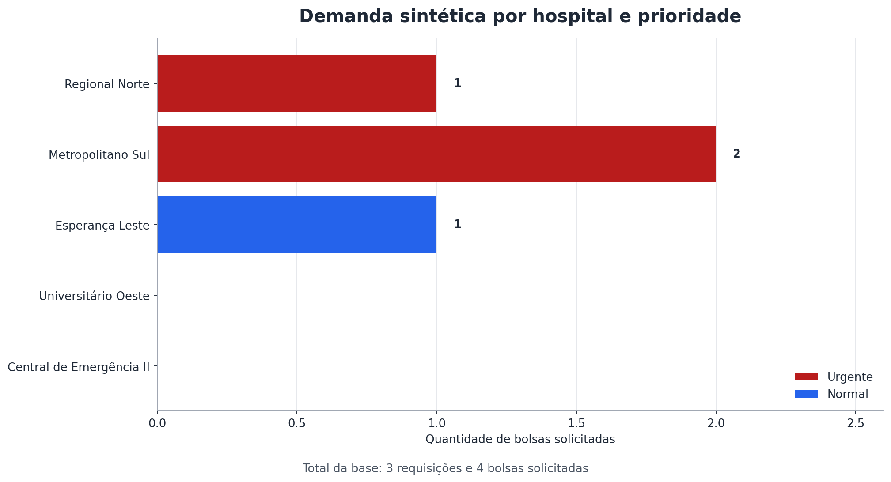
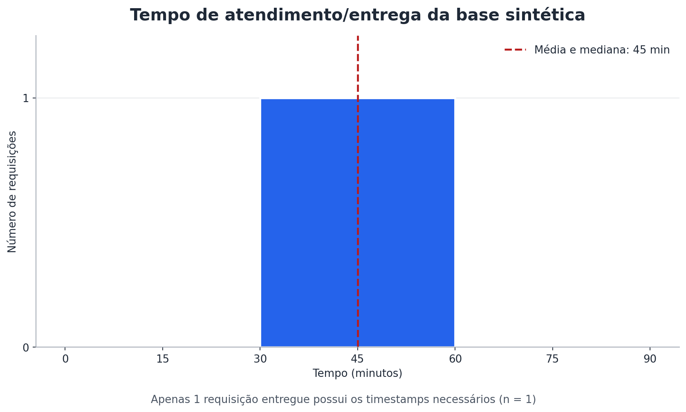

# Relatório de análise descritiva U1 — Rota Vital

**Disciplina:** Estatística e Probabilidade

**Atividade:** PI2-111

**História relacionada:** PI2-25 — HU07, painel gerencial

**Data da análise:** 27/09/2026

## 1. Objetivo

Descrever o estoque e a demanda da base sintética persistida do Rota Vital,
com atenção à distribuição por tipo sanguíneo e hemocomponente, à demanda por
hospital e prioridade e ao tempo de atendimento/entrega.

> **Nota:** todos os dados deste relatório são sintéticos e existem apenas para
> desenvolvimento, testes e avaliação acadêmica. Eles não representam doadores,
> hospitais ou operações reais.

## 2. Base e metodologia

A análise usa a carga padrão persistida pelo `DataInitializer`, já integrada à
`main` pela PI2-109 no commit `2f9ea6e`. A base contém:

- 12 bolsas disponíveis;
- 5 hospitais cadastrados;
- 3 requisições, que somam 4 bolsas solicitadas;
- 1 requisição entregue com os timestamps necessários para calcular o tempo.

Para o estoque, foram calculadas frequências absolutas e relativas. Para a
demanda, foram consideradas tanto a quantidade de requisições quanto a soma das
bolsas solicitadas. O tempo foi calculado em minutos entre `dataSolicitacao` e
`dataChegadaPrevista`, seguindo a regra atualmente utilizada por
`IndicadoresService`.

As medidas usadas foram:

- **média:** soma dos valores dividida pelo número de observações;
- **mediana:** valor central após a ordenação;
- **desvio-padrão populacional:** raiz da média dos desvios quadráticos;
- **mínimo e máximo:** menor e maior valor observado.

## 3. Distribuição do estoque

### 3.1 Por tipo sanguíneo

| Tipo sanguíneo | Bolsas | Frequência relativa |
|---|---:|---:|
| A+ | 2 | 16,67% |
| A− | 1 | 8,33% |
| B+ | 1 | 8,33% |
| B− | 1 | 8,33% |
| AB+ | 1 | 8,33% |
| AB− | 1 | 8,33% |
| O+ | 3 | 25,00% |
| O− | 2 | 16,67% |
| **Total** | **12** | **100,00%** |

Medidas descritivas da quantidade de bolsas entre os oito tipos:

| Medida | Resultado |
|---|---:|
| Média | 1,50 |
| Mediana | 1,00 |
| Desvio-padrão populacional | 0,71 |
| Mínimo | 1 |
| Máximo | 3 |

**Interpretação:** O+ é o tipo mais representado, com 25% da base. Cinco dos
oito tipos possuem somente uma bolsa. A diferença entre o mínimo de 1 e o
máximo de 3 mostra uma concentração moderada em O+, mas o tamanho reduzido da
base não permite tratar essa distribuição como estimativa de uma rede real.

### 3.2 Por hemocomponente

| Hemocomponente | Bolsas | Frequência relativa |
|---|---:|---:|
| Hemácias | 12 | 100,00% |
| Plasma | 0 | 0,00% |
| Plaquetas | 0 | 0,00% |
| Crioprecipitado | 0 | 0,00% |
| **Total** | **12** | **100,00%** |

**Interpretação:** a carga sintética persistida contém apenas hemácias. O painel
consegue agrupar outros hemocomponentes, mas a base atual ainda não permite
comparar a disponibilidade entre as quatro categorias. Para uma análise mais
representativa, cargas futuras devem incluir plasma, plaquetas e
crioprecipitado.

## 4. Demanda por hospital e prioridade

O gráfico e as tabelas de demanda usam a quantidade de bolsas solicitadas, e
não apenas o número de requisições. Essa distinção é importante porque uma única
requisição pode solicitar mais de uma bolsa.

| Hospital | Requisições | Urgentes (bolsas) | Normais (bolsas) | Total de bolsas | Status da requisição |
|---|---:|---:|---:|---:|---|
| Hospital Regional Norte | 1 | 1 | 0 | 1 | Pendente |
| Hospital Metropolitano Sul | 1 | 2 | 0 | 2 | Aprovada |
| Hospital Esperança Leste | 1 | 0 | 1 | 1 | Entregue |
| Hospital Universitário Oeste | 0 | 0 | 0 | 0 | — |
| Hospital Central de Emergência II | 0 | 0 | 0 | 0 | — |
| **Total** | **3** | **3** | **1** | **4** | — |

| Prioridade | Requisições | Participação nas requisições | Bolsas solicitadas | Participação nas bolsas |
|---|---:|---:|---:|---:|
| Urgente | 2 | 66,67% | 3 | 75,00% |
| Normal | 1 | 33,33% | 1 | 25,00% |
| **Total** | **3** | **100,00%** | **4** | **100,00%** |

**Interpretação:** o Hospital Metropolitano Sul apresenta a maior demanda da
base, com duas bolsas. As solicitações urgentes representam 75% das bolsas
pedidas. Esse resultado descreve somente os três registros sintéticos e não
deve ser generalizado como padrão de demanda hospitalar.

## 5. Tempo de atendimento/entrega

Somente a requisição do Hospital Esperança Leste está entregue e associada a
uma rota com `dataChegadaPrevista`. A diferença entre a solicitação e a chegada
prevista é de 45 minutos.

| Medida | Resultado |
|---|---:|
| Observações válidas | 1 |
| Média | 45 min |
| Mediana | 45 min |
| Desvio-padrão populacional | 0 min |
| Mínimo | 45 min |
| Máximo | 45 min |

**Interpretação:** média, mediana, mínimo e máximo coincidem porque existe apenas
uma observação. O desvio-padrão igual a zero não indica regularidade operacional;
ele apenas reflete a ausência de outros tempos para comparação. Além disso, o
modelo atual registra `dataChegadaPrevista`, não um horário separado de chegada
real. Portanto, o valor deve ser interpretado como tempo de entrega calculado
com a informação disponível no sistema.

## 6. Conclusão

A base persistida atende ao objetivo de demonstrar o cálculo dos indicadores,
mas ainda é pequena para conclusões probabilísticas ou operacionais. Ela mostra
maior presença de bolsas O+, estoque composto exclusivamente por hemácias,
predominância de demanda urgente e um único tempo mensurável de 45 minutos.

As próximas cargas sintéticas podem aumentar a qualidade da análise ao incluir
mais hemocomponentes, requisições para todos os hospitais e múltiplas entregas
com horário real de chegada. Com essas ampliações, média, mediana, dispersão e
formato da distribuição de tempos passarão a representar melhor o comportamento
simulado da rede.

## 7. Rastreabilidade

- Fonte do estoque: `rotavital/src/main/java/com/hemorede/algoritmos/DadosSinteticos.java`;
- persistência e requisições: `rotavital/src/main/java/com/hemorede/config/DataInitializer.java`;
- regra do tempo: `rotavital/src/main/java/com/hemorede/service/IndicadoresService.java`;
- integração dos dados persistidos: commit `2f9ea6e` da PI2-109.
