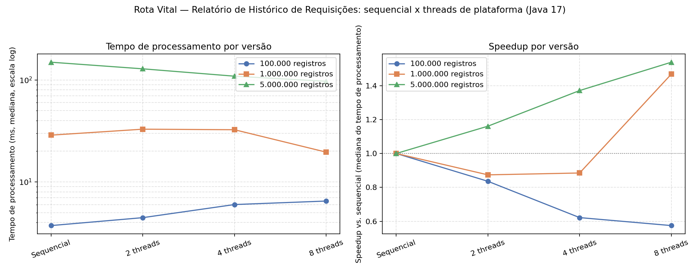

# Rota Vital: Entrega de SO, Processamento Paralelo de um Endpoint Real

**Disciplina:** Sistemas Operacionais (SO), Projeto Integrador, 3º período ADS, CESAR School

**Data:** 22/09/2026

**Equipe (Rota Vital):**

| Função | Responsável |
|---|---|
| Tech Lead | Lucas Henrique Gomes Medeiros |
| Gerente de Projetos | Luis Felipe Farias Nunes |
| Desenvolvedor Backend | João Pedro Cavalcanti Souza |
| Desenvolvedor Backend | Luis Lucena Wanderley G. |
| Desenvolvedor Backend | Matheus Rodrigues Larré |
| Engenheira de Dados | Micaella Maria Barbosa Cabral |
| Desenvolvedor Frontend | Mariana Xavier Bezerra |

**Responsável pela implementação e pelo benchmark desta entrega (SO):** Luis Felipe Farias Nunes

---

## 1. Justificativa

### 1.1 Operação escolhida

**Relatório nacional de estatísticas do histórico de requisições**, um endpoint que, dado um
histórico de N requisições de hemocomponentes (status, tipo sanguíneo, hemocomponente,
prioridade e tempo de atendimento), calcula contagens por categoria, soma/média/mínimo/máximo
do tempo de atendimento e o total de requisições urgentes ainda pendentes. É a mesma família de
cálculo que o `IndicadoresService` já implementado na sprint de Estatística (EPIC-05) faz sobre
uma amostra de 5 registros; aqui ela é promovida a um serviço de primeira classe
(`RelatorioHistoricoService`), pensado desde o início para escala nacional e para threads.

### 1.2 Por que essa e não as outras candidatas do roteiro

| Candidata | Gargalo real em escala nacional | Dá para particionar sem coordenação? |
|---|---|---|
| **Relatórios/estatísticas do histórico** (escolhida) | Processamento: é uma redução (soma, contagem, min, max) sobre dados já em memória, sem I/O no laço quente | **Sim**: cada fatia é independente; o merge final é O(threads), trivial |
| Cruzamento requisições × estoque | Cada cruzamento envolve consulta ao banco (JPA); o tempo é dominado por I/O de rede/disco, não por CPU | Parcialmente, mas paralelizar consultas ao mesmo banco só desloca o gargalo para o pool de conexões |
| Ordenação de filas por prioridade | Hoje já é O(log n) por inserção (`PriorityQueue`, um heap); o volume por fila (por estoque/tipo sanguíneo) é pequeno, não nacional | Sim, mas com overhead de merge (ordenação paralela) maior que o ganho nesse volume |
| Detecção de duplicatas | O(n) com uma tabela hash, mas essa tabela seria estado compartilhado, exigindo `synchronized`/lock, ou estruturas concorrentes que reintroduzem contenção | Não trivialmente, sem ferir a regra de "nenhuma seção crítica" |
| Validações em lote (ABO/Rh, estoque mínimo) | Cada validação, sozinha, é O(1)/O(log n) e normalmente depende do estado atual do estoque no banco | O volume por lote é pequeno; o gargalo, de novo, tende a ser I/O |

A operação escolhida é a única em que a resposta às três perguntas do roteiro é inequivocamente
favorável: (1) o tempo é gasto **calculando**, não esperando banco/rede, pois os dados do histórico
já estão carregados em uma `List` em memória quando o processamento começa; (2) a complexidade é
conhecida e simples de justificar; (3) os dados são particionáveis em fatias **disjuntas e
independentes**, sem nenhum estado mutável compartilhado durante o cálculo.

### 1.3 Complexidade (Big-O) da versão sequencial

Para N registros, a versão sequencial faz **uma única passada** pela lista. Para cada registro:
quatro `merge` em `EnumMap` (O(1) amortizado, já que o número de chaves, status, tipos
sanguíneos, hemocomponentes e prioridades, é uma constante pequena e fixa, independente de N),
mais comparações e somas O(1) para o tempo de atendimento. Não há ordenação, não há busca
aninhada, não há recomputação. Logo, o algoritmo é **O(n)** em tempo e **O(1)** em memória
adicional (fora a própria lista de entrada; as chaves dos mapas de saída têm cardinalidade fixa,
não crescem com N).

### 1.4 Onde está o gargalo e por que os dados são particionáveis

Numa rede com milhares de hospitais e milhões de requisições registradas por dia, um painel de
indicadores acessado o dia inteiro dispara esse cálculo repetidamente sobre um histórico que só
cresce. Mesmo sendo O(n) e de baixo custo por elemento, em milhões de registros essa única
passada ocupa uma única thread/um único núcleo por um tempo proporcional a N, enquanto o resto
dos núcleos do servidor fica ocioso: o clássico desperdício de capacidade que a entrega pede
para atacar.

A operação se presta a paralelismo porque a redução é **associativa e comutativa**: somar,
contar, tirar mínimo/máximo e contar por categoria de N1 + N2 elementos dá o mesmo resultado que
somar/contar/mín/máx de N1 e de N2 separadamente e depois combinar os dois parciais, em qualquer
ordem. Isso permite dividir a lista de entrada em `p` fatias contíguas e disjuntas (sem
sobreposição de índices), processar cada fatia numa thread independente, escrevendo só num
acumulador **local** àquela thread, e só ao final, depois que todas as fatias terminaram,
combinar os `p` acumuladores parciais num único resultado. Não há seção crítica durante o
processamento: cada thread só lê a sua fatia (uma *view* somente leitura de `subList`) e só
escreve no seu próprio objeto `AgregadoHistorico`. A única etapa que toca "estado compartilhado"
é o merge final, feito sequencialmente pela thread chamadora depois que `ExecutorService
.invokeAll(...)` já garantiu (via `Future`) que todas as tarefas terminaram: um `join` implícito
que elimina qualquer corrida entre "ler o parcial" e "a thread ainda estar escrevendo nele".

É exatamente o padrão *map-reduce*: **map** (cada thread reduz sua fatia) seguido de **reduce**
(o chamador combina os `p` resultados parciais, O(p)). O trabalho total continua O(n); o que
muda é que ele é dividido entre `p` threads, o que idealmente reduz o tempo de parede por um
fator próximo de `p` (ver seção 4).

---

## 2. O serviço (endpoint real, Spring Boot)

Implementado em `rotavital/src/main/java/com/hemorede/`, **em Java 17**: a mesma versão do
`pom.xml` e do CI do resto do Projeto Integrador não muda nesta entrega.

- `relatorio/RegistroHistoricoRequisicao.java`: um registro do histórico (record).
- `relatorio/GeradorHistoricoRequisicoes.java`: gera (com semente fixa, portanto
  determinística) e mantém em cache massas sintéticas de 100 mil, 1 milhão e 5 milhões de
  registros, para que o custo de *gerar* os dados não entre na medição do *processamento*.
- `relatorio/AgregadoHistorico.java`: acumulador mutável de uma fatia (soma, contagem,
  min/máx, contagens por categoria em `EnumMap`); usado tanto pela versão sequencial (uma
  instância só) quanto por cada thread da versão paralela (uma instância por fatia).
- `relatorio/RelatorioHistoricoService.java`: as **duas** versões do processamento que fazem
  parte da entrega obrigatória, `processarSequencial` e `processarComThreads` (pool fixo de
  threads de plataforma via `ExecutorService`/`Executors.newFixedThreadPool`), ambas 100%
  compatíveis com Java 17.
- `controller/RelatorioHistoricoController.java`: expõe
  `GET /api/v1/relatorios/historico?tamanho=&modo=&threads=` (`modo` = `sequencial` ou
  `paralelo`), devolvendo o resultado mais o tempo de processamento medido no servidor
  (`System.nanoTime`, em ms e ns).
- `dto/RelatorioHistoricoResponse.java`: o formato da resposta.

A requisição chega pelo Tomcat embutido, o controller busca (ou gera, na primeira vez) o
histórico do tamanho pedido, aciona a versão de processamento escolhida e devolve a resposta em
JSON: é um endpoint real, não um script solto, seguindo a stack (Java/Spring Boot) do Projeto
Integrador. **`pom.xml` e o pipeline (`.github/workflows/ci.yml`) permanecem em Java 17**, sem
nenhuma alteração, pois o professor confirmou que o Java 21 é opcional e serve só para a comparação
de destaque com virtual threads, não para a entrega em si.

**Bônus opcional isolado (virtual threads, Java 21):** o item "para destaque" do roteiro, repetir
a medição com virtual threads do Java 21 e comparar com threads de plataforma, está implementado
à parte, em `scripts/virtual-threads/`, **fora** de `src/main/java` e fora do build Maven
(`mvn package`/CI não tocam nesse diretório). Ver `scripts/virtual-threads/README.md` para o
porquê do isolamento e como compilar/rodar (exige um JDK 21 só para essa parte).

**Corretude (sequencial == paralelo, sempre):** `RelatorioHistoricoServiceTest` compara, para
2/3/4/5/8/16 threads de plataforma, o resultado da versão paralela com o da sequencial usando
`assertThat(...).isEqualTo(...)` (9 testes, todos verdes, Java 17). O script de benchmark
(`scripts/benchmark_relatorio_historico.py`) reforça essa checagem em tempo de execução real: a
cada chamada HTTP, compara um hash do JSON do campo `resultado` com o hash obtido na versão
sequencial e **aborta o benchmark** se divergirem. O benchmark completo, com 100 mil, 1 milhão e
5 milhões de registros, rodou do início ao fim sem nenhuma divergência. A comparação opcional com
virtual threads tem seu próprio teste de corretude embutido no `main()` de
`ComparacaoVirtualThreads.java` (mesma checagem `equals`, sem exceção lançada em nenhuma
execução).

---

## 3. Medições

Ambiente do benchmark: aplicação empacotada (`mvn package`, Java 17) e executada como processo
Spring Boot único (Tomcat embutido), medições feitas com um cliente HTTP externo (`scripts/
benchmark_relatorio_historico.py`), 6 chamadas de aquecimento descartadas mais 15 chamadas medidas
por combinação, reportando a **mediana**. Máquina com **2 núcleos de CPU** (relevante para a
análise da seção 4). `tempoProcessamento` é medido dentro do próprio endpoint (não inclui rede/
serialização); `tempoRespostaHttp` é o round-trip completo medido pelo cliente.

| Registros | Versão | Threads | Tempo de processamento (ms, mediana) | Tempo de resposta HTTP (ms, mediana) | Speedup (processamento) |
|---:|---|---:|---:|---:|---:|
| 100.000 | Sequencial | 1 | 3,7 | 5,5 | 1,00× |
| 100.000 | Paralelo | 2 | 4,5 | 6,3 | 0,84× |
| 100.000 | Paralelo | 4 | 6,0 | 8,1 | 0,62× |
| 100.000 | Paralelo | 8 | 6,5 | 8,6 | 0,58× |
| 1.000.000 | Sequencial | 1 | 28,8 | 30,8 | 1,00× |
| 1.000.000 | Paralelo | 2 | 32,9 | 34,9 | 0,87× |
| 1.000.000 | Paralelo | 4 | 32,5 | 34,3 | 0,89× |
| 1.000.000 | Paralelo | 8 | 19,6 | 22,5 | 1,47× |
| 5.000.000 | Sequencial | 1 | 149,3 | 154,7 | 1,00× |
| 5.000.000 | Paralelo | 2 | 128,6 | 133,3 | 1,16× |
| 5.000.000 | Paralelo | 4 | 108,9 | 111,3 | 1,37× |
| 5.000.000 | Paralelo | 8 | 97,0 | 99,8 | 1,54× |

CSV completo (medianas, mínimos, máximos): `scripts/resultados/benchmark_relatorio_historico.csv`
(gerado por `scripts/benchmark_relatorio_historico.py`).



---

## 4. Análise

O ganho não foi linear em nenhum tamanho de entrada, e em 100 mil e 1 milhão de registros ele
chega a ser **negativo** (speedup abaixo de 1, ou seja, paralelizar piorou o tempo). Em 100 mil, o
processamento sequencial já leva menos de 4 ms: o custo fixo de criar o pool de threads e
disparar/coletar as tarefas (`Executors.newFixedThreadPool`, `invokeAll`, `Future.get`) é maior
que o tempo que sobra para dividir, e esse overhead cresce com o número de threads, daí o tempo
piorar progressivamente de 2 para 8 threads. Em 1 milhão, o mesmo efeito aparece com 2 e 4 threads
(overhead ainda não compensado), mas em 8 threads o processamento já é grande o suficiente para o
ganho superar o custo fixo (1,47×). Em 5 milhões, o padrão finalmente fica monotônico e mais
próximo do esperado (1,16× para 1,37× para 1,54× de 2 a 8 threads), mas ainda **longe do speedup
linear** que 8 threads sugeririam (8×): a máquina do benchmark tem só **2 núcleos físicos**, então
a partir de mais ou menos 2 threads simultâneas o restante já está competindo por tempo de CPU nos
mesmos núcleos (troca de contexto), sem paralelismo real adicional, e nesse volume o garbage
collector, pressionado pela alocação dos 5 milhões de registros e das fatias intermediárias,
também disputa esses mesmos 2 núcleos com as threads de trabalho. Esse é o retrato da Lei de
Amdahl combinado com um teto de hardware bem baixo: mesmo se a fração sequencial do próprio
algoritmo fosse zero (e ela quase é, só o merge final O(p) é sequencial), o speedup nunca
passaria de perto de 2× nesta máquina, porque só há 2 unidades de execução física. O restante do
"paralelismo" pedido nas configurações de 4 e 8 threads é apenas concorrência sendo simulada por
troca de contexto do escalonador do SO sobre um hardware que não tem mais núcleos para oferecer.

A Big-O **não muda**: sequencial e paralelo continuam O(n); o que a paralelização altera é a
constante multiplicativa percebida (tempo de parede), distribuindo o mesmo trabalho entre p
threads e somando um custo extra O(p) de criação/coordenação/merge que a versão sequencial não
paga. Quando o volume por fatia é pequeno demais (100 mil registros dividido por 8 threads é
aproximadamente 12,5 mil elementos por fatia, um laço de poucos microssegundos), esse custo extra
domina e o speedup fica abaixo de 1.

A diferença entre concorrência e paralelismo fica clara comparando com a Mesa DJ: lá, as threads
atendiam eventos concorrentes e independentes entre si (pedidos de música chegando em momentos
diferentes, cada um podendo ser processado fora de ordem sem que isso mude o resultado correto),
então concorrência é sobre *estrutura*: intercalar tarefas que nem precisam de múltiplos núcleos
para fazer sentido (inclusive tarefas I/O-bound, em que a CPU fica ociosa esperando disco/rede
enquanto outra tarefa avança). Aqui as threads não atendem eventos diferentes: elas dividem
**um único** volume de dados para terminá-lo mais rápido. Paralelismo é sobre *desempenho*, exige
núcleos de verdade executando simultaneamente, e só compensa quando o trabalho por fatia supera o
overhead de dividir e há núcleos físicos livres para receber essas fatias ao mesmo tempo (o
próprio benchmark acima mostra o que acontece quando essa segunda condição falta).

Quando nem 8 threads bastarem (por o volume ter crescido além do que os núcleos disponíveis dão
conta, ou por já não haver mais núcleos livres na máquina), a evolução natural é sair de "mais
threads no mesmo processo" para "mais processos/mais máquinas": particionar o histórico entre
várias instâncias da aplicação atrás de um load balancer (escalonamento horizontal), pré-computar
os indicadores de forma assíncrona (fila + worker) e servir o painel a partir de um resultado já
pronto (cache/materialização) em vez de recalcular a cada requisição, e mover a agregação pesada
para um motor de processamento distribuído (estilo MapReduce/Spark) quando um único servidor
deixar de caber os dados em memória. Esse é o gancho natural para a discussão de arquitetura em
camadas da Unidade 2.

### Threads virtuais (Java 21): comparação opcional

Medida à parte (chamada direta ao `RelatorioHistoricoService` dentro da JVM, sem passar pelo
endpoint HTTP, ver seção 6 e `scripts/virtual-threads/README.md`), com a mesma lógica de
aquecimento (8 chamadas descartadas) mais mediana de 11 medições. Nos tamanhos menores (100 mil), os
tempos de todas as versões já ficam na casa de poucos milissegundos, dominados por ruído de
agendamento do SO, sem diferença clara entre plataforma e virtual. No maior volume medido (5
milhões), virtual threads (8 e 64 fatias, cerca de 70 a 72 ms) ficaram no mesmo patamar das threads
de plataforma com 8 threads (74 ms): nem melhor nem pior de forma relevante. Isso é o esperado para
**esta operação especificamente**: o trabalho é 100% CPU-bound (nenhuma chamada bloqueante de
I/O dentro do laço de agregação), e é justamente nesse cenário que virtual threads não trazem
vantagem sobre threads de plataforma. A vantagem das virtual threads aparece quando há muito mais
tarefas do que núcleos disponíveis *e* essas tarefas bloqueiam esperando I/O (banco, rede, disco),
porque aí a JVM consegue "estacionar" a virtual thread bloqueada e liberar a thread de plataforma
carregadora para outra tarefa, multiplicando a concorrência sem multiplicar núcleos. Numa
agregação puramente matemática sobre dados já em memória, como a desta entrega, não há bloqueio
nenhum para "esconder", por isso os números ficam parecidos com os das threads de plataforma, e
ambos continuam limitados pelo mesmo teto de 2 núcleos físicos discutido acima.

---

## 5. Como reproduzir

```bash
cd rotavital
mvn test -Dtest=RelatorioHistoricoServiceTest   # corretude: sequencial == paralelo (Java 17)
mvn -DskipTests package
java -jar target/hemorede-0.0.1-SNAPSHOT.jar --server.port=8089 &
python3 scripts/benchmark_relatorio_historico.py --base-url http://localhost:8089 \
    --tamanhos 100000 1000000 5000000 --repeticoes 15 --aquecimento 6 --saida scripts/resultados
python3 scripts/gerar_grafico_speedup.py scripts/resultados/benchmark_relatorio_historico.csv \
    doc/img/grafico_speedup.png
```

Comparação opcional com virtual threads (precisa de um JDK 21 instalado; não faz parte do build
normal do projeto, ver `scripts/virtual-threads/README.md` para detalhes):

```bash
javac --release 21 -cp target/classes -d /tmp/vt-out \
    scripts/virtual-threads/src/com/hemorede/relatorio/ComparacaoVirtualThreads.java
java --class-path "target/classes:/tmp/vt-out" \
    com.hemorede.relatorio.ComparacaoVirtualThreads 100000 1000000 5000000
```

## 6. Código

Entrega obrigatória (Java 17, faz parte do `mvn package`/CI normal):
`rotavital/src/main/java/com/hemorede/relatorio/`,
`rotavital/src/main/java/com/hemorede/controller/RelatorioHistoricoController.java`,
`rotavital/src/main/java/com/hemorede/dto/RelatorioHistoricoResponse.java`,
testes em `rotavital/src/test/java/com/hemorede/relatorio/RelatorioHistoricoServiceTest.java`,
scripts de benchmark em `rotavital/scripts/`.

Bônus opcional (Java 21, fora do build normal, compilado/rodado manualmente):
`rotavital/scripts/virtual-threads/src/com/hemorede/relatorio/ComparacaoVirtualThreads.java` e
`rotavital/scripts/virtual-threads/README.md`.

`pom.xml` e `.github/workflows/ci.yml` **não foram alterados**: o projeto continua em Java 17 do
início ao fim.

Repositório: https://github.com/Luisr-nunes/projeto_Rota_Vital
